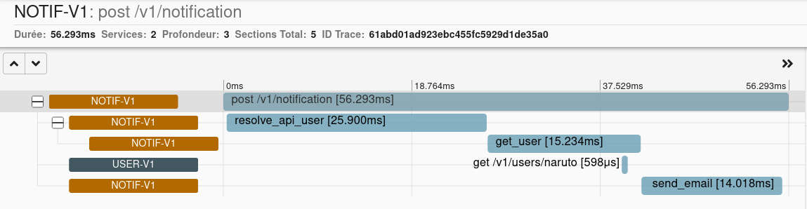

HTTP Middlewares
================

Aioli let permit to inject headers on every requests.

Here is a dummy example.

::

   class DummyMiddleware(Middleware):

      def __call__(self, next: Middleware) -> Middleware:
         async def handle(req: HTTPRequest, method: HttpMethod, client_name: ClientName, path: Path) -> HTTPResponse:
               req.headers["x-request-header"] "foo"
               return await next(req, method, client_name, path)

        return handle

   dummy_middleware = DummyMiddleware()

   sd = StaticDiscovery({("api", None): "http://srv:8000/"})
   cli = ClientFactory(sd)
   cli.add_middleware(dummy_middleware)

Create a middleware to trace metrics using zipkin
-------------------------------------------------

The middleware is usefull to forward parameter in an http context.

For example, using zipkin, some headers has to be passed to sub services,
to achieve this, lets create a simple middleware that forward the headers.

::

   class AioliMiddleware:
      """
      Middleware to inject a aoili client factory in the asgi scope.
      
      
      The client is fowarding zipkin header to track api calls.
      """

      def __init__(
         self,
         app: ASGIApp,
      ):
         self.app = app
         self.sd = ConsulDiscovery()
         self.cli = ClientFactory(self.sd)
         self.middleware = HTTPMiddleware(headers={})
         self.cli.add_middleware(self.middleware)

      async def __call__(self, scope: Scope, receive: Receive, send: Send) -> None:
         if scope["type"] not in ["http"]:
               await self.app(scope, receive, send)
               return

         # The trace is managed by another middleware.
         trace = cast(Trace, scope.get("trace"))
         if trace is not None:
               self.middleware.headers=trace.http_headers
         scope["aioli_client"] = self.cli
         await self.app(scope, receive, send)

Full example
------------

You will find an example using prometheus in the examples directory:

   https://github.com/mardiros/aioli/tree/master/examples/zipkin_tracing

   Example of querying the prometheus instance on http://prometheus.localhost/
