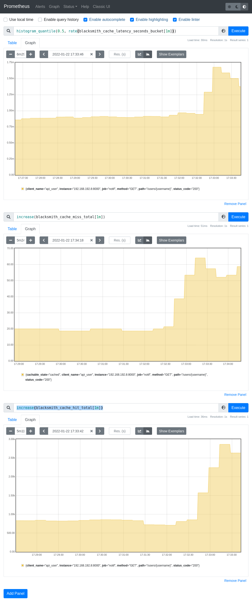

.. _`HTTP Cache Middleware`:

HTTP Cache Middleware
=====================

Sometime, for performance reason, caching avoid lots of compute made in
services. Blacksmith comes with a middleware based on redis and that cache
response using the :term:`Cache-Control` HTTP header.

The caching middleware only cache response that have the ``public`` directive
in the ``Cache-Control`` response and cache it depending on the ``max-age``
and the ``age`` of the response.
It also interpret the ``Vary`` response header to create distinct response
depending on the request headers.

It requires an extra dependency `redis` or `aioredis` installed using the
following command.

::

   # For async client
   pip install blacksmith[http_cache_async]
   # For sync client
   pip install blacksmith[http_cache_sync]

Or using poetry

::

   # For async client
   poetry add blacksmith -E http_cache_async
   # For sync client
   poetry add blacksmith -E http_cache_sync

Usage using the async api
-------------------------

.. literalinclude:: cache_middleware_async.py

.. important::

   Using redis, the middleware **MUST BE** initialized.

   To initialize middlewares, the method :meth:`blacksmith.ClientFactory.initialize`
   has to be called after instantiation.

   Example using initializing in an ASGI service running with hypercorn.

   .. literalinclude:: ../../../../examples/http_cache/notif/src/notif/entrypoint.py

Usage using the sync api
------------------------

.. literalinclude:: cache_middleware_sync.py

Combining caching and prometheus
--------------------------------

.. important::

   The order of the middleware is important.

GOOD
~~~~

In the example above, prometheus **will not count** cached request:

.. code-block:: python
   :emphasize-lines: 8,9
   :linenos:
   from redis import asyncio as aioredis

   cache = aioredis.from_url("redis://redis/0")
   sd = AsyncConsulDiscovery()
   metrics = PrometheusMetrics()
   cli = (
      AsyncClientFactory(sd)
      .add_middleware(AsyncHTTPCacheMiddleware(cache, metrics=metrics))
      .add_middleware(AsyncPrometheusMiddleware(metrics))
   )

BAD
~~~

In the example above, prometheus **will count** cached request:

.. code-block:: python
   :emphasize-lines: 8,9
   :linenos:
   from redis import asyncio as aioredis

   cache = aioredis.from_url("redis://redis/0")
   sd = AsyncConsulDiscovery()
   metrics = PrometheusMetrics()
   cli = (
      AsyncClientFactory(sd)
      .add_middleware(AsyncPrometheusMiddleware(metrics))
      .add_middleware(AsyncHTTPCacheMiddleware(cache, metrics=metrics))
   )

.. warning::

   By adding the cache after the prometheus middleware, the metrics
   ``blacksmith_request_latency_seconds`` will mix the API response
   from the cache and from APIs.

Full example of the http_cache
------------------------------

You will find an example using prometheus and the circuit breaker in the examples directory:

   https://github.com/mardiros/blacksmith/tree/master/examples/http_cache

   Example with metrics on http://prometheus.localhost/
