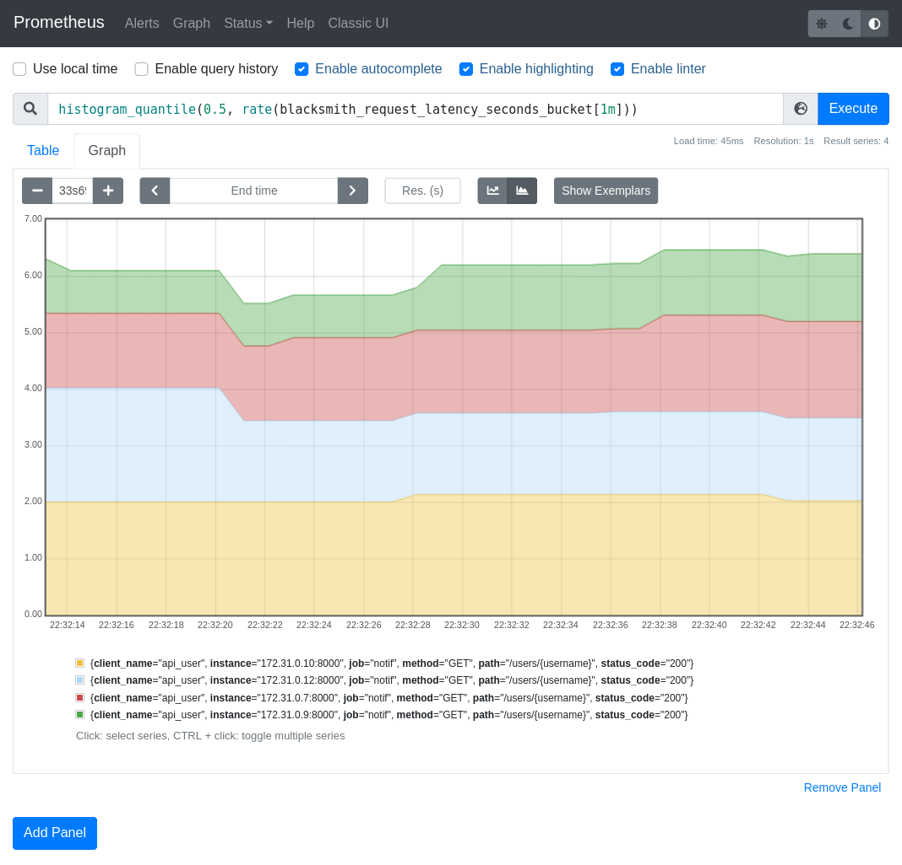

Prometheus Middleware
=====================

Blacksmith can expose api calls metrics using :term:`Prometheus`.

It requires the extra dependency `prometheus_client`_ installed using the
following command.

.. _`prometheus_client`: https://pypi.org/project/prometheus-client/

::

   pip install blacksmith[prometheus]

Or using poetry

::

   poetry add blacksmith -E prometheus

To use the prometheus middlware, it has to be added to the `ClientFactory`.

Async
~~~~~

.. literalinclude:: prometheus_middleware_async.py

Sync
~~~~

.. literalinclude:: prometheus_middleware_sync.py

Metrics
-------

While installing the metrics collector, it will add metrics on api call made.

There is `blacksmith_request_latency_seconds` Histogram and `blacksmith_info` Gauge.

blacksmith_request_latency_seconds Histogram
~~~~~~~~~~~~~~~~~~~~~~~~~~~~~~~~~~~~~~~~~~~~

Histogram have 3 metrics that are `blacksmith_request_latency_seconds_count`,
`blacksmith_request_latency_seconds_sum` and `blacksmith_request_latency_seconds_bucket`.

All those metrics are incremented on every API calls.

You may configure the buckets using the parameter buckets

::

   from blacksmith import AsyncPrometheusMetrics
   BUCKETS = [0.05, 0.1, 0.2, 0.4, 0.8, 1.6, 3.2, 6.4, 12.8, 25.6]
   metric = AsyncPrometheusMetrics(buckets=BUCKETS)

`blacksmith_request_latency_seconds` labels are  `client_name`, `method`,
`path`, `status_code`.

.. note::

   The :term:`client_name` can indicated the service at its version, and, because a
   service can register the same method/path many times, it can be usefull
   to get the monitoring on every binding.

   Imagine the same route is consumed to get different aspect of the resource
   in many place of a code base. It can be appropriate to register different
   clients to distingate them.

   Example of `blacksmith_request_latency_seconds` Histogram

blacksmith_circuit_breaker_state Gauge
~~~~~~~~~~~~~~~~~~~~~~~~~~~~~~~~~~~~~~

While combining with the :ref:`Circuit Breaker Middleware`,
a metrics `blacksmith_circuit_breaker_state` Gauge is added to get the
states of circuit breakers per :term:`client_name`.

 * `0` - the circuit breaker is `closed`.
 * `1` - the circuit breaker is `half-open`.
 * `2` - the circuit breaker is `open`.

blacksmith_circuit_breaker_error Counter
~~~~~~~~~~~~~~~~~~~~~~~~~~~~~~~~~~~~~~~~

While combining with the :ref:`Circuit Breaker Middleware`,
a metrics `blacksmith_circuit_breaker_error_total`

blacksmith_info Gauge
~~~~~~~~~~~~~~~~~~~~~

The metrics is `blacksmith_info` which is a Gauge that always return 1, it is usefull
to get the version of the blacksmith client installed, in its label `version`.

Expose metrics
--------------

After collecting metrics in the registry, the metrics has to be exposed,
because blacksmith is a client purpose API, it does not offer a way to expose
them, but, usually, a web framework application is used for that,
and used scrapped by a Prometheus instanced.

Example using starlette
~~~~~~~~~~~~~~~~~~~~~~~

::

   from prometheus_client import (
      generate_latest, CONTENT_TYPE_LATEST, REGISTRY
   )
   from starlette.applications import Starlette
   from starlette.responses import Response

   app = Starlette()

   @app.route("/metrics", methods=["GET"])
   async def get_metrics(request):
      resp = Response(
         generate_latest(REGISTRY),
         media_type=CONTENT_TYPE_LATEST,
         )
      return resp

.. note::

   REGISTRY is the default registry, `PrometheusMetrics` can be 
   build by specifying another registry if necessary:

   ::

      from blacksmith import AsyncPrometheusMetrics
      prom_middleware = AsyncPrometheusMetrics(registry=my_registry)

Full examples of prometheus metrics
-----------------------------------

You will find an example using prometheus in the examples directory:

 * https://github.com/mardiros/blacksmith/tree/master/examples/prometheus_metrics

 * https://github.com/mardiros/blacksmith/tree/master/examples/circuit_breaker
