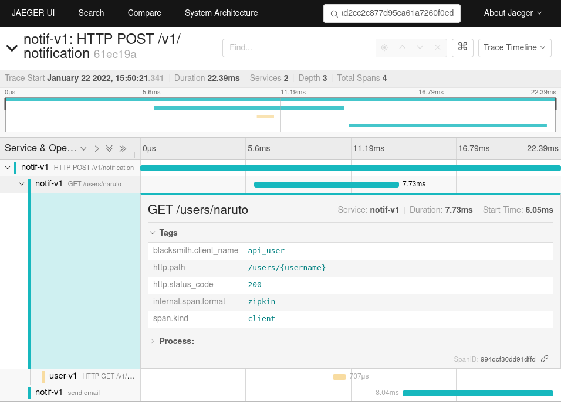

Tracing using Zipkin Middleware
===============================

In microservices architecture, to troubleshoot problems, it is convenient
to trace all sub requests and more using a tracer such as Zipkin or Jaeger.

In blacksmith, the zipkin middleware can be added to trace all the sub requests.

Example using starlette_zipkin:

.. literalinclude:: zipkin_middleware.py

Full example of the zipkin middleware
-------------------------------------

You will find an example using prometheus in the examples directory:

   https://github.com/mardiros/blacksmith/tree/master/examples/zipkin_tracing

   Example with Jaeger on http://jaegier.localhost/

