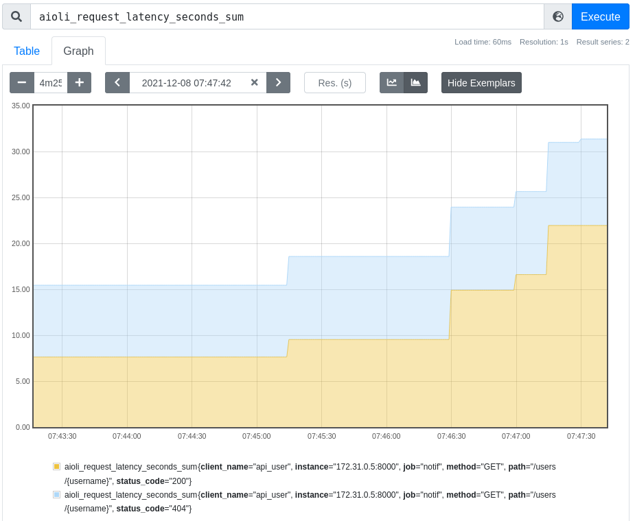

Monitoring metrics
==================

Aioli can expose api calls metrics using :term:`Prometheus`.

This is accomplished during the instantiation of the `ClientFactory`.

::

   from aioli import ClientFactory, PrometheusMetrics, StaticDiscovery
   sd = StaticDiscovery({("api", None): "http://srv:8000/"})
   cli = ClientFactory(sd, metrics=PrometheusMetrics())

While installing the metrics collector, it will add metrics on api call
made.

Currently collected metrics are `aioli_info` which is a Gauge that always
return 1, it is usefull to get the version of the aioli client installed,
in its label `version`.
The other metrics is `aioli_http_requests_total` which is a Counter that
increment on every API calls.

Labels are  `client_name`, `method`, `path`, `status_code`.
The client_name can indicated the service at its version, and, because a
service can register the same method/path many times, it can be usefull
to get the monitoring on every binding.

Imagine the same route is consumed to get different aspect of the resource
in many place of a code base. It can be appropriate to register different
clients to distingate them.

After collecting metrics in the registry, the metrics has to be exposed,
because aioli is a client purpose API, it does not offer a way to expose
them, but, usually, a web framework application is used for that,
and used scrapped by a Prometheus instanced.

Example using starlette.

::

   from prometheus_client import (
      generate_latest, CONTENT_TYPE_LATEST, REGISTRY
   )
   from starlette.applications import Starlette
   from starlette.responses import Response

   app = Starlette()

   @app.route("/metrics", methods=["GET"])
   async def get_metrics(request):
      resp = Response(
         generate_latest(REGISTRY),
         media_type=CONTENT_TYPE_LATEST,
         )
      return resp

.. note::

   REGISTRY is the default registry, `PrometheusMetrics` can be 
   build by specifying another registry if necessary:

   ::

      metric = PrometheusMetrics(my_registry)

Full example
------------

You will find an example using prometheus in the examples directory:

   https://github.com/mardiros/aioli/tree/master/examples/prometheus_metrics

   Example of querying the prometheus instance on http://prometheus.localhost/
