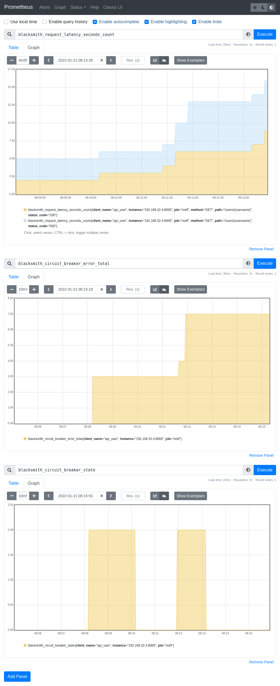

Forked prometheus example with circuit breaker
==============================================

This example is a dummy microservice stack that send email to a user.

There is a "user" service which contains a users API used to retrieve fake email.

There is a "notification" api that take a username in parameter and a message
to send.

The "notification" service retrieve the "email" of the "user" and
send the message to the email address.

Requirements
------------

 * docker
 * docker-compose

Start the stack
---------------

docker-compose up

Call the service
----------------

::

   curl -H "Content-Type: application/json" \
      --data '{"username": "naruto", "message": "Datte Bayo"}' \
      -X POST http://notif.localhost/v1/notification

   # Raise 500 errors to open the circuit breaker
   curl -H "Content-Type: application/json" \
      --data '{"username": "sasuke", "message": "Sharingan!"}' \
      -X POST http://notif.localhost/v1/notification

After doing many 500 errors, the circuit will be open, then sending message
to naruto will also raise 500 because of the circuit.

Check result
------------

The mailbox is available in a web application http://mailhog.localhost/
to view the email has been properly received.

The api calls count are stored in the prometheus after scrapping:

http://prometheus.localhost/graph?g0.expr=blacksmith_request_latency_seconds_count

